# Documentación Técnica Profesional
# VPN Client-to-Site Multipunto — IPSec IKEv1 con L2TP

**Estudiante:** Junior Javier Santos Pérez  
**Matrícula:** 2024-1599  
**Plataforma:** PNETLab  

Video demostrativo: https://www.youtube.com/watch?v=o0DL2w4sEnU

---

## Tabla de Contenido

1. [Objetivo de la VPN](#objetivo-de-la-vpn)
2. [Topología de Red](#topología-de-red)
3. [Direccionamiento IP](#direccionamiento-ip)
4. [Parámetros Usados](#parámetros-usados)
5. [Configuración del Servidor VPN](#configuración-del-servidor-vpn)
6. [Configuración de los Clientes Kali Linux](#configuración-de-los-clientes-kali-linux)
7. [Capturas de Pantalla con Explicación](#capturas-de-pantalla-con-explicación)
8. [Verificación y Resultados](#verificación-y-resultados)

---

## Objetivo de la VPN

Esta práctica tiene como objetivo implementar una **VPN Client-to-Site punto a multipunto** utilizando el protocolo **L2TP (Layer 2 Tunneling Protocol)** encapsulado sobre **IPSec IKEv1**, permitiendo que múltiples clientes remotos (Linux/Windows) se conecten de forma segura a la red corporativa interna a través de un router Cisco IOS que actúa como servidor VPN.

### Objetivos específicos:

- Implementar autenticación IKEv1 con clave precompartida (PSK)
- Cifrar el tráfico con AES-256 y hash SHA-256
- Crear un pool de direcciones IP para asignación dinámica a clientes
- Permitir conexiones simultáneas de múltiples clientes (multipunto)
- Verificar conectividad extremo a extremo entre clientes VPN y la red interna

### ¿Por qué L2TP sobre IPSec?

| Característica | Valor |
|---|---|
| L2TP solo | Sin cifrado — inseguro |
| IPSec solo | No transporta múltiples protocolos de red |
| **L2TP + IPSec** | **Autenticación + cifrado + soporte multipunto** ✅ |

---

## Topología de Red

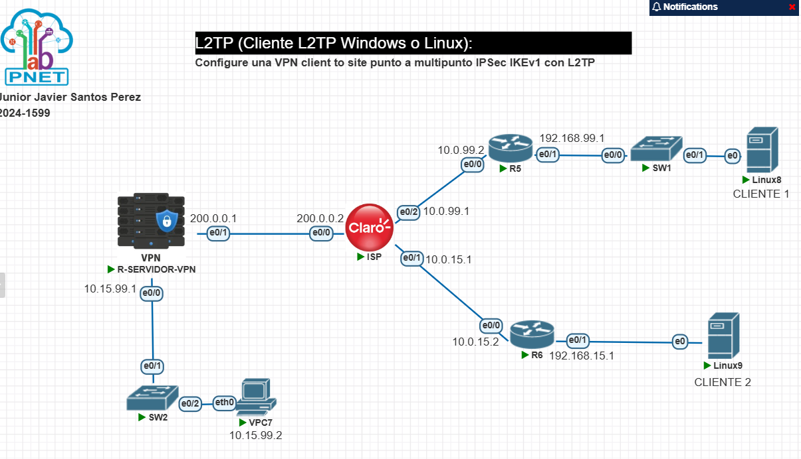

> **Figura 1:** Topología completa del laboratorio en PNETLab. El R-SERVIDOR-VPN actúa como concentrador VPN. Linux8 (CLIENTE 1) y Linux9 (CLIENTE 2) se conectan desde redes remotas simulando Internet a través del ISP (Claro).

### Descripción de dispositivos

| Dispositivo | Rol | Sistema Operativo |
|---|---|---|
| R-SERVIDOR-VPN | Servidor VPN / Gateway | Cisco IOS 15.7(3)M2 |
| ISP | Router ISP simulado | Cisco IOS 15.7(3)M2 |
| R5 | Router acceso Cliente 1 | Cisco IOS 15.7(3)M2 |
| R6 (R11) | Router acceso Cliente 2 | Cisco IOS 15.7(3)M2 |
| SW1 | Switch capa 2 | Cisco IOS |
| SW2 | Switch capa 2 LAN interna | Cisco IOS |
| Linux8 | Cliente VPN 1 | Kali Linux |
| Linux9 | Cliente VPN 2 | Kali Linux |
| VPC7 | Host red interna | VPCS |
| Linux | Servidor red interna | Linux |

---

## Direccionamiento IP

### Tabla de interfaces y direcciones

| Dispositivo | Interfaz | Dirección IP | Máscara | Descripción |
|---|---|---|---|---|
| R-SERVIDOR-VPN | e0/0 | 10.15.99.1 | /24 | LAN interna |
| R-SERVIDOR-VPN | e0/1 | 200.0.0.1 | /30 | WAN hacia ISP |
| ISP | e0/0 | 200.0.0.2 | /30 | Hacia R-SERVIDOR-VPN |
| ISP | e0/2 | 10.0.99.1 | /24 | Hacia R5 |
| ISP | e0/1 | 10.0.15.1 | /24 | Hacia R6 |
| R5 | e0/0 | 10.0.99.2 | /24 | Hacia ISP |
| R5 | e0/1 | 192.168.99.1 | /24 | Hacia SW1/Linux8 |
| R6 | e0/0 | 10.0.15.2 | /24 | Hacia ISP |
| R6 | e0/1 | 192.168.15.1 | /24 | Hacia Linux9 |
| Linux8 | eth0 | 192.168.99.2 | /24 | Cliente VPN 1 |
| Linux9 | eth0 | 192.168.15.15 | /24 | Cliente VPN 2 |
| VPC7 | eth0 | 10.15.99.2 | /24 | Host LAN interna |
| VPN-POOL | — | 192.168.99.10–50 | /32 | Pool para clientes VPN |

### Tabla de enrutamiento

| Router | Red destino | Máscara | Siguiente salto |
|---|---|---|---|
| R-SERVIDOR-VPN | 0.0.0.0 | 0.0.0.0 | 200.0.0.2 |
| ISP | 192.168.99.0 | /24 | 10.0.99.2 |
| ISP | 192.168.15.0 | /24 | 10.0.15.2 |
| ISP | 10.15.99.0 | /24 | 200.0.0.1 |
| R5 | 0.0.0.0 | 0.0.0.0 | 10.0.99.1 |
| R6 | 0.0.0.0 | 0.0.0.0 | 10.0.15.1 |

---

## Parámetros Usados

### Parámetros IKEv1 (Phase 1 — ISAKMP)

| Parámetro | Valor | Justificación |
|---|---|---|
| Algoritmo de cifrado | AES-256 | Cifrado simétrico de alta seguridad |
| Algoritmo hash | SHA-256 | Integridad con 256 bits |
| Autenticación | Pre-Shared Key (PSK) | Simplicidad en laboratorio |
| Grupo Diffie-Hellman | Grupo 14 (2048 bits) | Intercambio de claves seguro |
| Lifetime | 86400 segundos (24 horas) | Tiempo estándar de renegociación |
| Clave PSK | cisco | Clave precompartida |

### Parámetros IPSec (Phase 2 — Transform Set)

| Parámetro | Valor |
|---|---|
| Protocolo ESP | esp-aes 256 |
| Hash ESP | esp-sha256-hmac |
| Modo | Transport (no Tunnel, L2TP ya encapsula) |
| PFS | No (simplificación de laboratorio) |

### Parámetros L2TP / PPP

| Parámetro | Valor |
|---|---|
| Protocolo túnel | L2TP |
| Autenticación PPP | MS-CHAPv2 |
| Cifrado PPP | MPPE Auto |
| Pool de IPs | 192.168.99.10 – 192.168.99.50 |
| Autenticación AAA | Local |

### Parámetros clientes Kali Linux

| Parámetro | Valor |
|---|---|
| Motor IPSec | strongSwan (charon) |
| Motor L2TP | xl2tpd |
| keyexchange | ikev1 (forzado) |
| ike | aes256-sha256-modp2048 |
| esp | aes256-sha256 |
| MTU/MRU | 1410 |

---

## Configuración del Servidor VPN

### Paso 1 — Configuración básica de interfaces

```cisco
hostname R-SERVIDOR-VPN

interface ethernet0/0
 description LAN
 ip address 10.15.99.1 255.255.255.0
 no shutdown

interface ethernet0/1
 description WAN-ISP
 ip address 200.0.0.1 255.255.255.252
 no shutdown
```

### Paso 2 — Enrutamiento

```cisco
ip route 0.0.0.0 0.0.0.0 200.0.0.2
```

### Paso 3 — AAA y usuarios locales

```cisco
aaa new-model
aaa authentication ppp VPN-AUTH local
aaa authorization network VPN-AUTHOR local

username kali1 secret cisco
username kali2 secret cisco
```

> **Nota:** Se usa `aaa authentication ppp` (no `login`) porque el protocolo PPP requiere su propia lista de autenticación. Se usa `secret` en lugar de `password` para almacenar la contraseña con hash MD5.

### Paso 4 — Pool de direcciones VPN

```cisco
ip local pool VPN-POOL 192.168.99.10 192.168.99.50
```

### Paso 5 — Política ISAKMP (IKEv1 Phase 1)

```cisco
crypto isakmp policy 10
 encr aes 256
 hash sha256
 authentication pre-share
 group 14
 lifetime 86400

crypto isakmp key cisco address 0.0.0.0 0.0.0.0
```

### Paso 6 — Transform Set IPSec (Phase 2)

```cisco
crypto ipsec transform-set L2TP-SET esp-aes 256 esp-sha256-hmac
 mode transport

crypto ipsec profile L2TP-PROFILE
 set transform-set L2TP-SET
```

### Paso 7 — VPDN L2TP

```cisco
vpdn enable

vpdn-group L2TP-SERVER
 accept-dialin
  protocol l2tp
  virtual-template 1
 no l2tp tunnel authentication
```

### Paso 8 — Virtual Template (interfaz PPP dinámica)

```cisco
interface Virtual-Template1
 ip unnumbered ethernet0/0
 peer default ip address pool VPN-POOL
 ppp authentication ms-chap-v2 VPN-AUTH
 ppp encrypt mppe auto
```

### Paso 9 — Crypto Map dinámico y aplicación

```cisco
crypto dynamic-map DYN-MAP 10
 set transform-set L2TP-SET
 reverse-route

crypto map VPN-MAP 10 ipsec-isakmp dynamic DYN-MAP

interface ethernet0/1
 crypto map VPN-MAP
```

---

## Configuración de los Clientes Kali Linux

### Instalación de dependencias

```bash
sudo apt update
sudo apt install -y strongswan xl2tpd ppp
```

### Archivo `/etc/ipsec.conf`

```
config setup
    charondebug="ike 2, knl 2, cfg 2"

conn L2TP-PSK
    keyexchange=ikev1
    authby=secret
    pfs=no
    auto=add
    keyingtries=3
    type=transport
    left=%defaultroute
    leftid=<IP_CLIENTE>
    leftprotoport=17/1701
    right=200.0.0.1
    rightid=200.0.0.1
    rightprotoport=17/1701
    ike=aes256-sha256-modp2048!
    esp=aes256-sha256!
    ikelifetime=86400s
    lifetime=3600s
```

> Linux8: `leftid=192.168.99.2` | Linux9: `leftid=192.168.15.15`

### Archivo `/etc/ipsec.secrets`

```
%any 200.0.0.1 : PSK "cisco"
```

### Archivo `/etc/xl2tpd/xl2tpd.conf` (agregar al final)

```
[global]
port = 1701

[lac vpn-cisco]
lns = 200.0.0.1
ppp debug = yes
pppoptfile = /etc/ppp/options.l2tpd.client
length bit = yes
```

### Archivo `/etc/ppp/options.l2tpd.client`

```
ipcp-accept-local
ipcp-accept-remote
refuse-eap
require-mschap-v2
noccp
noauth
name kali1
password cisco
idle 1800
mtu 1410
mru 1410
defaultroute
usepeerdns
debug
```

> Linux9: cambiar `name kali2`

### Levantar la VPN

```bash
sudo systemctl restart strongswan-starter
sudo systemctl restart xl2tpd
sudo ipsec up L2TP-PSK
sleep 2
echo "c vpn-cisco" | sudo tee /var/run/xl2tpd/l2tp-control
```

---

## Capturas de Pantalla con Explicación

### 1. SAs ISAKMP activas (IKEv1 Phase 1)

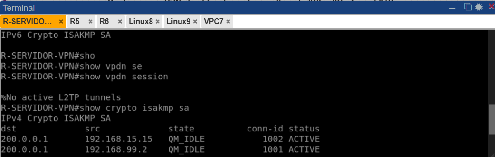

> **Figura 2:** El comando `show crypto isakmp sa` muestra dos asociaciones de seguridad en estado `QM_IDLE` (Quick Mode Idle), lo que indica que la fase 1 de IKEv1 está completamente establecida con ambos clientes: Linux8 (192.168.99.2) y Linux9 (192.168.15.15). El estado ACTIVE confirma que las SAs están vigentes.

---

### 2. Sesiones VPDN L2TP activas — Multipunto

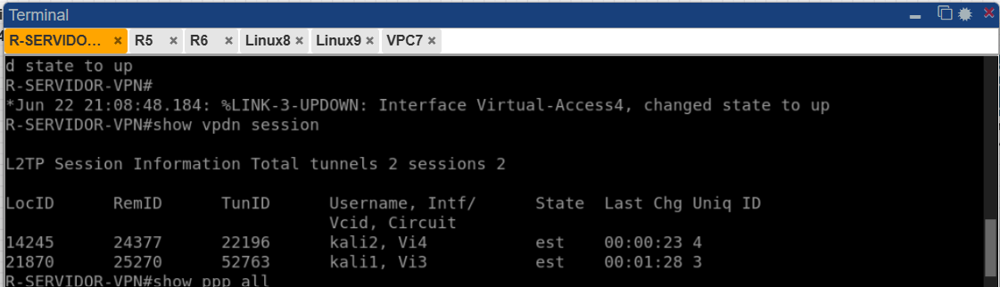

> **Figura 3:** El comando `show vpdn session` muestra **2 túneles y 2 sesiones L2TP activas simultáneamente**. Esto confirma la naturaleza multipunto de la VPN. Se puede observar que kali1 usa la interfaz virtual Vi3 y kali2 usa Vi4, ambas en estado `est` (established).

---

### 3. Interfaces PPP activas con clientes

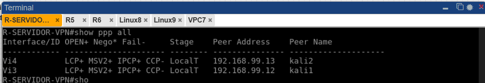

> **Figura 4:** El comando `show ppp all` muestra las dos interfaces PPP activas. Vi3 tiene conectado a kali1 con IP 192.168.99.12 y Vi4 a kali2 con IP 192.168.99.13. Los protocolos LCP+, MSV2+ (MS-CHAPv2) e IPCP+ confirmados indican una negociación PPP exitosa.

---

### 4. Pool VPN con 2 IPs en uso

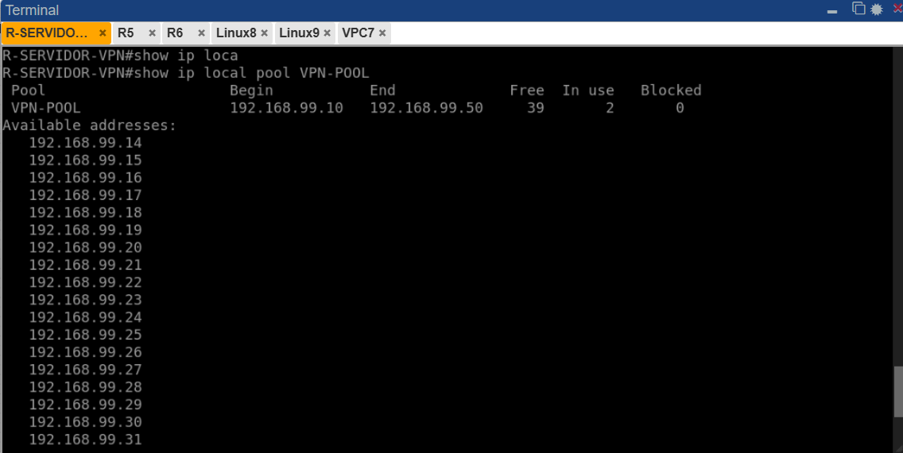

> **Figura 5:** El comando `show ip local pool VPN-POOL` muestra que del pool de 41 IPs disponibles (192.168.99.10–50), hay **2 en uso**, correspondiendo a los dos clientes VPN activos. Esto confirma la asignación dinámica de IPs.

---

### 5. SA IPSec con estadísticas de paquetes cifrados

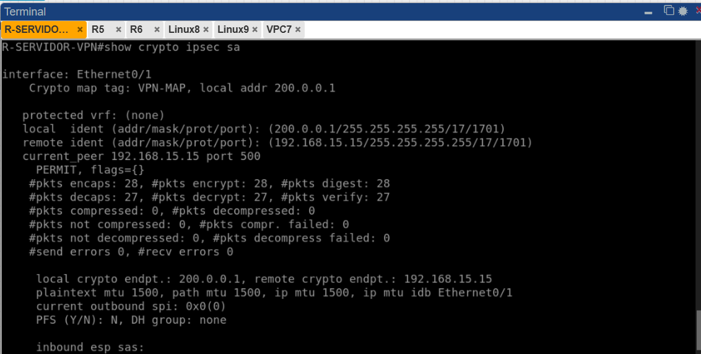

> **Figura 6:** El comando `show crypto ipsec sa` muestra los detalles de la asociación de seguridad IPSec para el cliente remoto 192.168.15.15. Se observan paquetes encapsulados/cifrados (`#pkts encaps: 28, encrypt: 28`) y desencapsulados/descifrados (`#pkts decaps: 27, decrypt: 27`), confirmando que el tráfico se transporta cifrado en modo transport.

---

### 6. Configuración AAA en el servidor

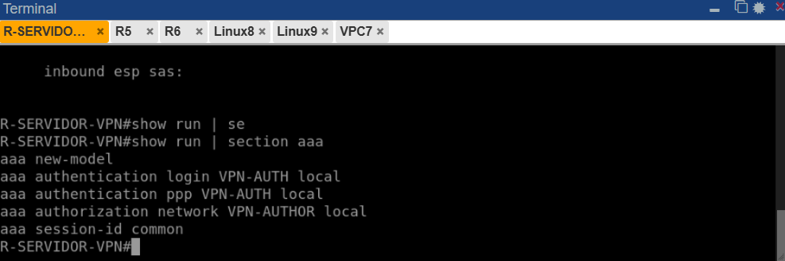

> **Figura 7:** El comando `show run | section aaa` muestra la configuración AAA del servidor. Se confirma que se usa `aaa authentication ppp VPN-AUTH local` (específico para PPP/L2TP) y `aaa authorization network VPN-AUTHOR local` para autorización de red.

---

### 7. Configuración completa Crypto y VPDN

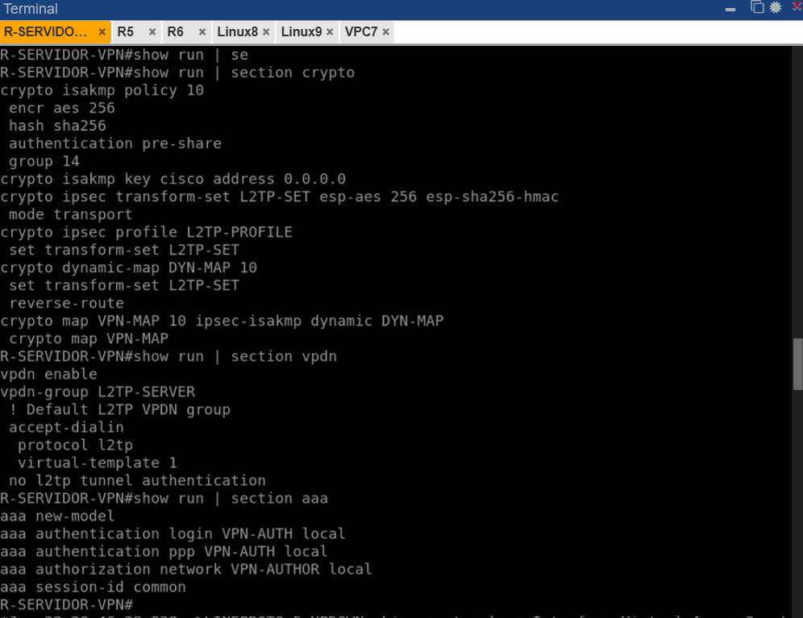

> **Figura 8:** Vista completa de la configuración de crypto (ISAKMP policy 10, transform-set L2TP-SET, dynamic-map DYN-MAP, crypto map VPN-MAP) y VPDN (grupo L2TP-SERVER con virtual-template 1) tal como quedó en el router servidor.

---

### 8. Establecimiento IPSec en Linux8 (Cliente 1)

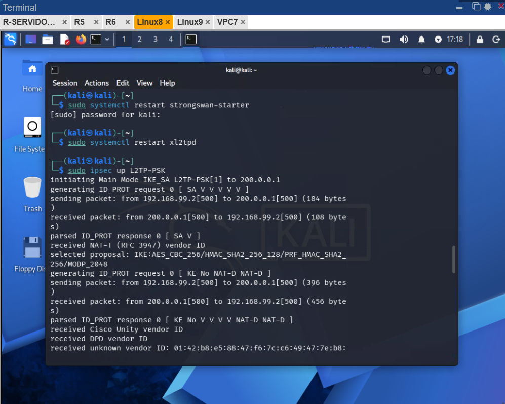

> **Figura 9:** Salida del comando `sudo ipsec up L2TP-PSK` en Linux8. Se observa el proceso completo de negociación IKEv1 en Main Mode: intercambio de propuestas SA, Diffie-Hellman, e identificación con PSK. El mensaje final `connection 'L2TP-PSK' established successfully` confirma el éxito.

---

### 9. Interfaz ppp0 activa en Linux8 con IP VPN

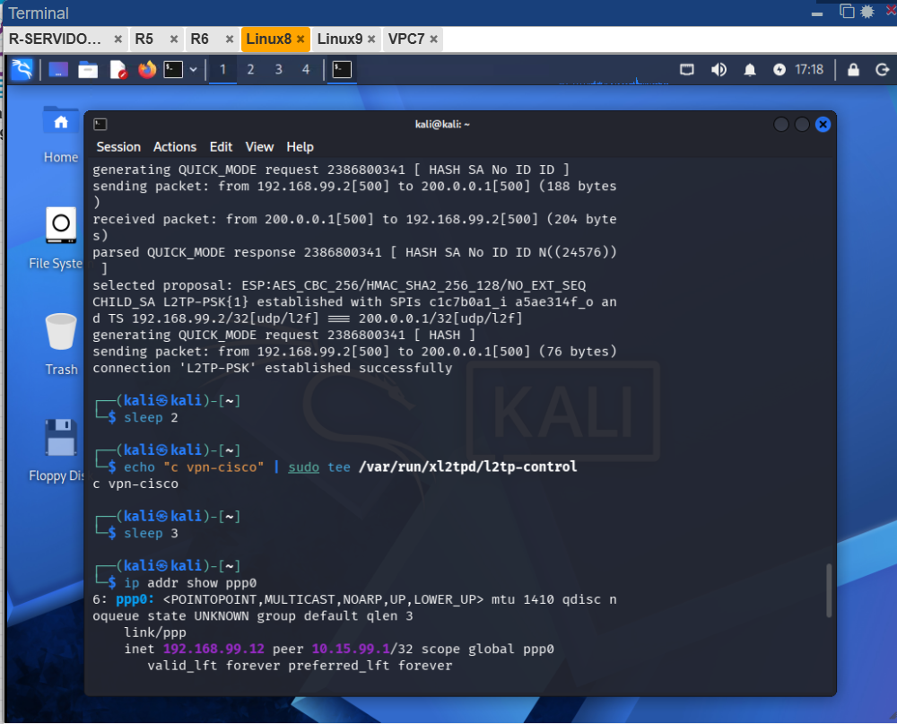

> **Figura 10:** El comando `ip addr show ppp0` en Linux8 muestra la interfaz PPP activa con IP 192.168.99.12 asignada desde el pool del servidor VPN. El peer es 10.15.99.1 (interfaz LAN del servidor). El estado `UP,LOWER_UP` confirma la conexión activa.

---

### 10. Establecimiento IPSec en Linux9 (Cliente 2)

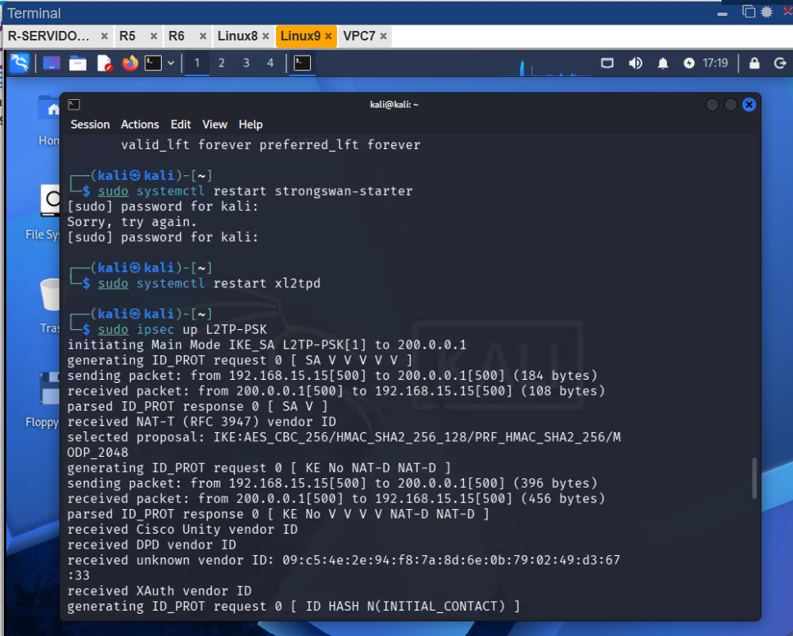

> **Figura 11:** Salida del proceso de negociación IKEv1 en Linux9. Se observa el mismo proceso exitoso que en Linux8, pero desde la IP 192.168.15.15. El mensaje `connection 'L2TP-PSK' established successfully` confirma el segundo túnel multipunto activo.

---

### 11. Interfaz ppp0 activa en Linux9 con IP VPN

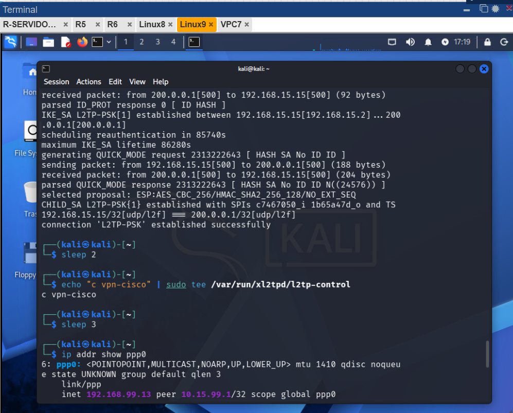

> **Figura 12:** El comando `ip addr show ppp0` en Linux9 muestra la interfaz PPP activa con IP 192.168.99.13, la siguiente IP disponible del pool después de la asignada a Linux8 (192.168.99.12). Esto demuestra la asignación dinámica secuencial del pool VPN-POOL.

---

### 12. Prueba de conectividad Linux9 → Red interna

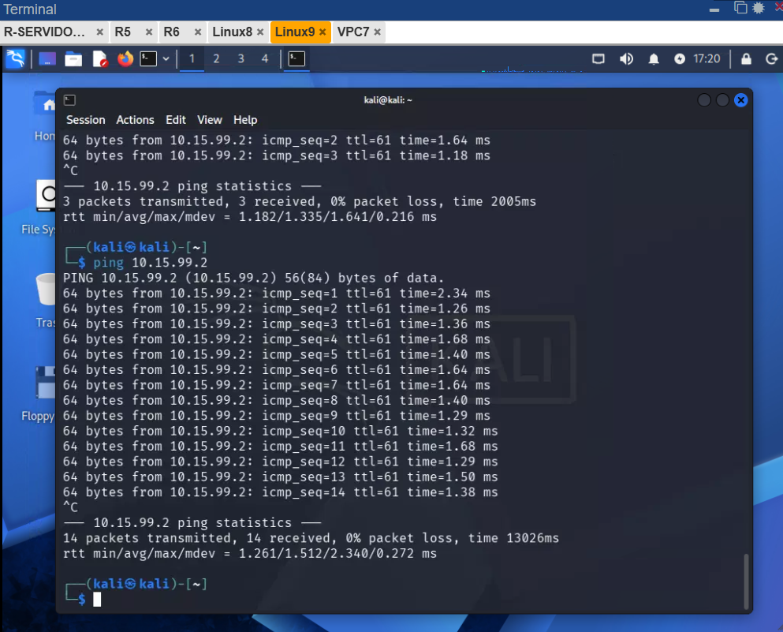

> **Figura 13:** Ping exitoso desde Linux9 (Cliente 2) hacia 10.15.99.2 (Linux en la red interna LAN del servidor VPN). Los paquetes viajan cifrados por el túnel L2TP/IPSec. Latencia promedio de 1.51 ms, 0% de pérdida de paquetes, confirmando conectividad completa.

---

### 13. Prueba de conectividad Linux8 → Red interna

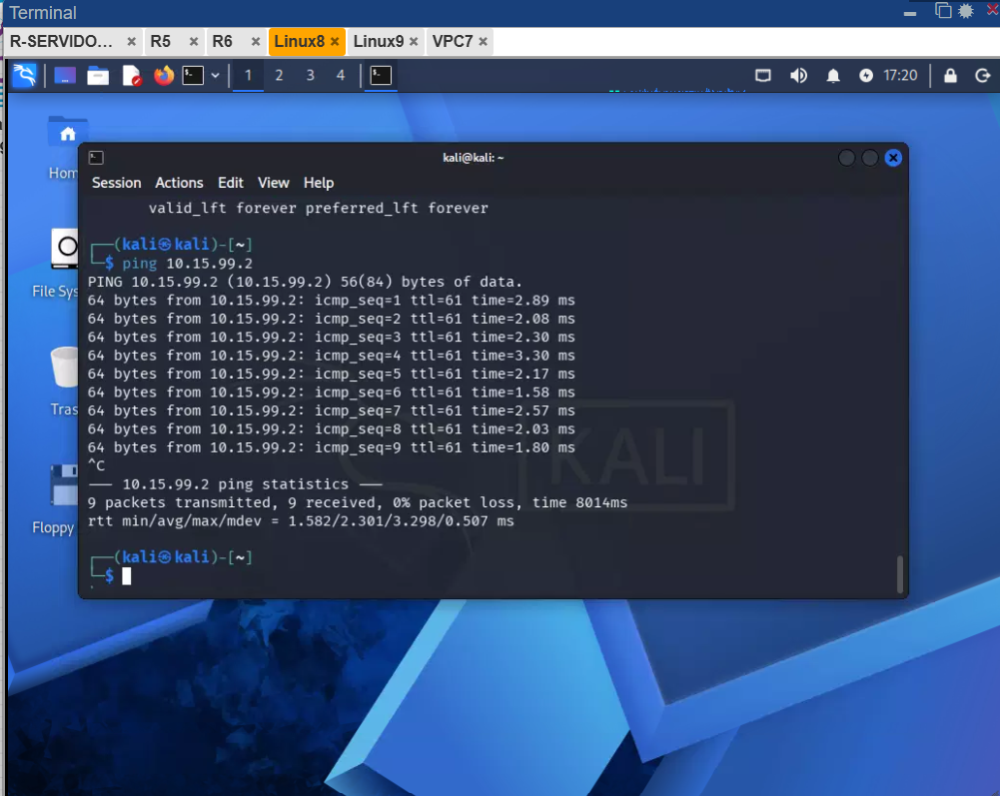

> **Figura 14:** Ping exitoso desde Linux8 (Cliente 1) hacia 10.15.99.2. Al igual que Linux9, el tráfico viaja encriptado a través del túnel VPN. Latencia promedio de 2.30 ms con 0% de pérdida, confirmando que ambos clientes tienen acceso a la red interna simultáneamente.

---

### 14. VPC7 (red interna) alcanza ambos clientes VPN

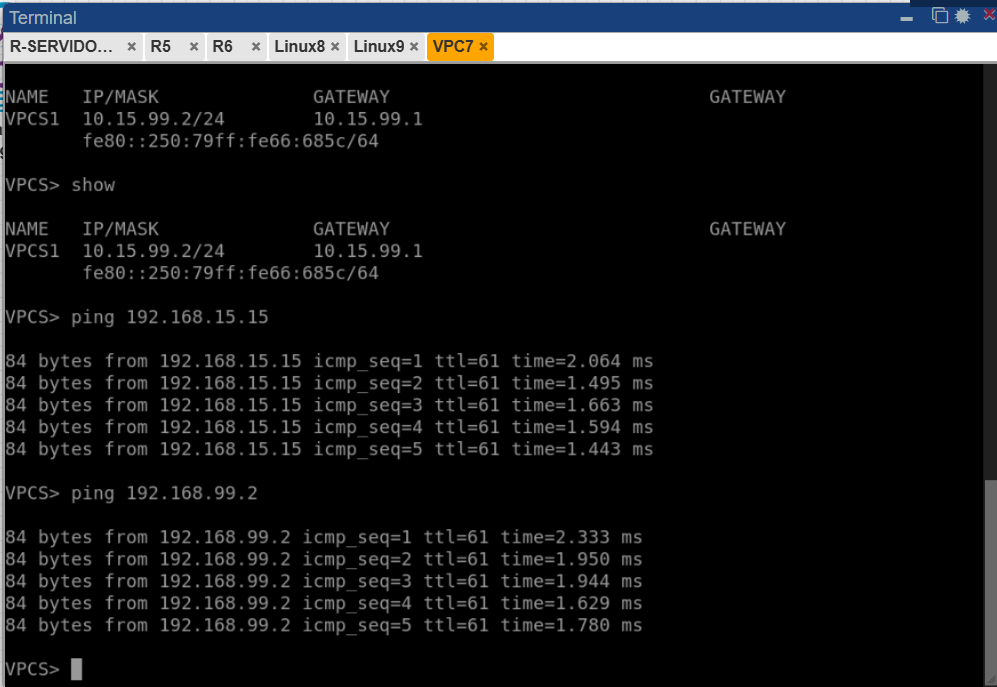

> **Figura 15:** Desde VPC7 (host de la red interna 10.15.99.2/24) se realizan pings exitosos hacia 192.168.15.15 (Linux9) y 192.168.99.2 (Linux8). Esto demuestra conectividad bidireccional completa: la red interna puede alcanzar a los clientes VPN, confirmando que las rutas inversas (`reverse-route` en el crypto map) funcionan correctamente.

---

## Verificación y Resultados

### Comandos de verificación en R-SERVIDOR-VPN

```cisco
show crypto isakmp policy        ! Ver política IKEv1 configurada
show crypto isakmp sa            ! Ver SAs Phase 1 activas
show crypto ipsec sa             ! Ver SAs Phase 2 con estadísticas
show vpdn session                ! Ver túneles L2TP activos
show ppp all                     ! Ver sesiones PPP con clientes conectados
show ip local pool VPN-POOL      ! Ver IPs asignadas del pool
show run | section crypto        ! Ver configuración crypto completa
show run | section vpdn          ! Ver configuración VPDN
show run | section aaa           ! Ver configuración AAA
```

### Resumen de resultados obtenidos

| Verificación | Resultado |
|---|---|
| `show crypto isakmp sa` | 2 SAs en estado QM_IDLE ACTIVE ✅ |
| `show vpdn session` | 2 túneles L2TP, 2 sesiones activas ✅ |
| `show ppp all` | Vi3 (kali1 - 192.168.99.12), Vi4 (kali2 - 192.168.99.13) ✅ |
| `show ip local pool VPN-POOL` | 2 IPs en uso de 41 disponibles ✅ |
| `ip addr show ppp0` en Linux8 | inet 192.168.99.12 peer 10.15.99.1 ✅ |
| `ip addr show ppp0` en Linux9 | inet 192.168.99.13 peer 10.15.99.1 ✅ |
| Ping Linux8 → 10.15.99.2 | 0% pérdida, ~2.3 ms ✅ |
| Ping Linux9 → 10.15.99.2 | 0% pérdida, ~1.5 ms ✅ |
| Ping VPC7 → clientes VPN | 0% pérdida bidireccional ✅ |

### Conclusión

Se implementó exitosamente una VPN **Client-to-Site punto a multipunto** usando **L2TP sobre IPSec IKEv1** en Cisco IOS 15.7(3)M2. Los dos clientes Kali Linux se conectaron simultáneamente al servidor, recibieron IPs dinámicas del pool configurado, y lograron conectividad completa con la red interna. El tráfico viaja cifrado con AES-256 y autenticado con SHA-256 y MS-CHAPv2, cumpliendo todos los requisitos de seguridad establecidos.
